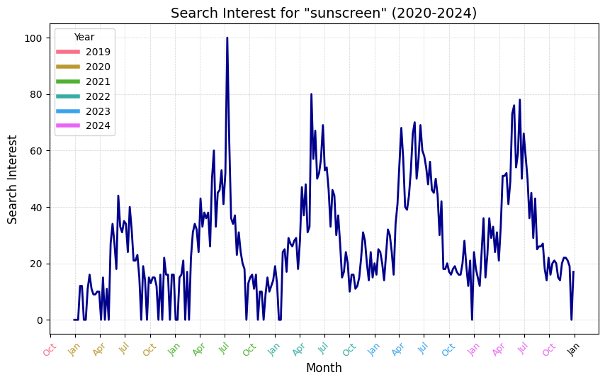
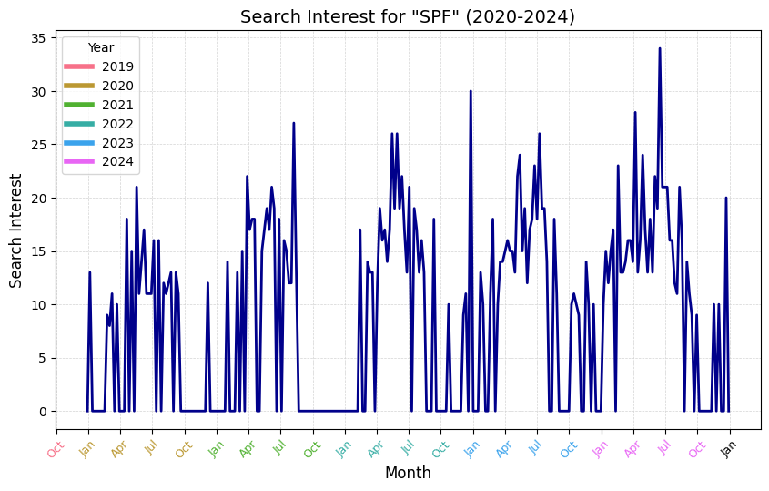
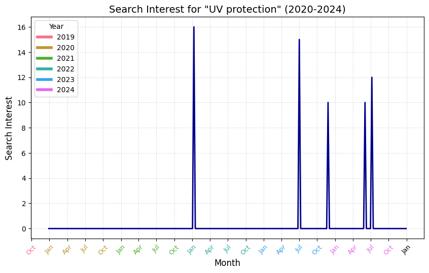
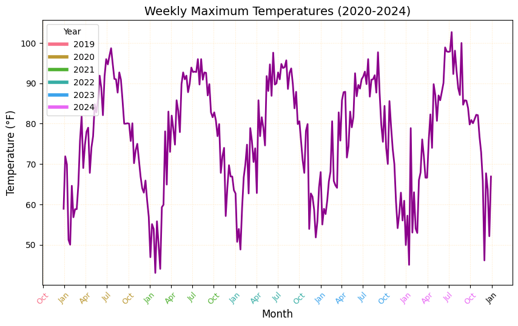

# Rising Temperatures and Interest in Sunscreen

This repository houses my data analytics project on the effect of weather patterns and changes in public sentiment regarding sun protection.

Table of Contents:
1. [Introduction](#introduction)
2. [Prerequisites](#prerequisites)
3. [Folder Structure](#folder-structure)
4. [Datasets](#datasets)
5. [Analysis](#analysis)
6. [Results and Discussion](#results-and-discussion)
7. [Caveats and Limitations](#caveats-and-limitations)

## Introduction
This project investigates the relationship between weather patterns and public interest in sun protection. By analyzing historical weather data alongside Google Trends search data, the goal is to uncover trends and potential correlations between changing environmental conditions and consumer behavior. The study focuses on data from 2020 to 2024, with an emphasis on maximum temperatures in the United States and the popularity of search terms related to sun protection, namely "sunscreen," "SPF," "UV protection," and "skincare."

## Prerequisites

Before you begin this project, ensure you have the following installed:

1. **Programming Language**:
   - Python 3.13.1 or higher.

2. **Dependencies**:
   - Install the required libraries using the `requirements.txt` file:
     ```bash
     pip3 install -r requirements.txt
     ```

3. **API Keys**:
   - Obtain an API key from:
     - [Visual Crossing Weather](https://www.visualcrossing.com/)
     - Note that no API key is required for the Google trends data using the pytrends library.
   - Save the VC Weather API key in an `.env` file as follows:
     ```
     VC_API_KEY=[your_visual_crossing_key]
     ```

4. **Tools**:
   - Git for version control (download from [git-scm.com](https://git-scm.com/)).

5. **System Requirements**:
   - Tested on macOS Monterey 12.5.
  
6. **Environment Setup**:
   - Optional: While not required, creating a virtual environment is recommended to isolate project dependencies and prevent conflicts with other Python projects. To create and activate a virtual environment, run the following in your command prompt:
     ```bash
     python -m venv env
     source env/bin/activate  # macOS command
     ```

## Folder Structure

```
trends-sunscreen-analysis/
│-- src/
│   │-- sentiment/
│   │   │-- google
│   │   │   │-- extract_google.py
│   │   │   │-- raw-data/
│   │   │   │   │-- usa-dc_weekly_trends_2020_2024.csv
│   │-- weather/
│   │   │-- visual-crossing/
│   │   │   │-- extract_vc_2020-21.py
│   │   │   │-- extract_vc_2022-23.py
│   │   │   │-- extract_vc_2024.py
│   │   │   │-- raw-data/
│   │   │   │   │-- usa_daily_weather_2020_2021.csv
│   │   │   │   │-- usa_daily_weather_2022_2023.csv
│   │   │   │   │-- usa_daily_weather_2024.csv
│-- analytics/
│   │-- data-cleaning/
│   │   │-- weather_trends_merged.py
│   │   │-- data_processing.py
│   │   │-- data/
│   │   │   │-- weather_trends_merged.csv
│   │   │   │-- weather_trends_cleaned.csv
│   │-- plot-time-series/
│   │   │-- plot_max_temps.py
│   │   │-- plot_max_uv.py
│   │   │-- plot_search_over_time.py
│   │-- plot-correlation/
│   │   │-- plot_search_vs_temp.py
│   │   │-- plot_search_vs_uv.py
│   │   │-- plot_overlay.py
│-- figures/
│   │-- plot-time-series/
│   │   │-- weekly_max_temp.png
│   │   │-- weekly_max_uv.png
│   │   │-- trend_sunscreen.png
│   │   │-- trend_SPF.png
│   │   │-- trend_UV_protection.png
│   │   │-- trend_skincare.png
│   │-- plot-correlation/
│   │   │-- temp_vs_sunscreen.png
│   │   │-- temp_vs_SPF.png
│   │   │-- temp_vs_UV_protection.png
│   │   │-- temp_vs_skincare.png
│   │   │-- uv_vs_sunscreen.png
│   │   │-- uv_vs_SPF.png
│   │   │-- uv_vs_UV_protection.png
│   │   │-- uv_vs_skincare.png
│   │-- plot-norm-overlay/
│   │   │-- normalized_temp_uv_vs_sunscreen.png
│   │   │-- normalized_temp_uv_vs_SPF.png
│   │   │-- normalized_temp_uv_vs_UV_protection.png
│   │   │-- normalized_temp_uv_vs_skincare.png
│-- .gitignore
│-- README.md
│-- requirements.txt
```

## Datasets

Two primary datasets are used in this analysis:

- Weather Data:

  - Source: Visual Crossing Weather, a platform providing historical and forecast weather data.
  - Content: Maximum daily temperatures and UV index values across the United States* from 2020 to 2024.
     - _*Note that VC weather data is always reported based on a point location. The location entered is geocoded to a point, and the weather at the port is returned as the result. In the case of this analysis, where the location is set to "USA," the geocoder appears to geocode the point to Washington, D.C._
  - Methodology: A Python script was employed to extract the data from the Visual Crossing Weather API.

- Google Trends Data:

  - Source: Google Trends, accessed via the Pytrends library.
  - Content: Search interest for keywords: "sunscreen," "SPF," "UV protection," and "skincare," over the same 2020–2024 timeframe.
  - Methodology: A Python script leveraging the Pytrends library was used to collect the search popularity data for each keyword.

These datasets provide the foundation for analyzing potential correlations between weather conditions and public interest in sun protection.

## Analysis

To conduct my analyses, I merged and cleaned two datasets (see folder analytics/data-cleaning/). First, I merged them to align search interest with the corresponding weather values for each week. Then, I cleaned the dataset by assigning proper data types and removing unnecessary fields to streamline the analysis.

Leveraging the cleaned dataset, I conducted three main types of analyses:

1. Time Series Analysis
   - I built time series plots to observe trends in maximum temperature, maximum UV index values, and search interest for each term over time.
2. Correlation Analysis
   - I created correlation plots to examine relationships between search interest for each term and the maximum temperature or UV index value for that week.
3. Normalized Overlay Analysis
   - To determine whether temperature or UV index had a stronger relationship with search interest, I normalized both values on a 0-1 scale and overlaid their trend lines for direct comparison.

*As a note: I used maximum temperature and UV index values instead of weekly averages to focus on the impact of extreme weather conditions. My hypothesis was that an especially hot or high-UV day might trigger increased search interest, whereas weekly averages could dilute these peaks.*

## Results and Discussion

### Key Findings

#### Search Interest and Weather Trends Over Time:

- Search interest for "sunscreen," "SPF," and "UV protection" exhibits seasonal fluctuations, peaking during summer months when temperatures and UV index values are highest. Excluding some spikes in 2021 and 2022, search interest for these terms has generally slightly increased from 2020 to 2024.
<p align="center">
  
  
  
</p>
- One notable anomaly occurred between June and July 2021, when search interest for "sunscreen" spiked significantly. However, when comparing this spike to temperature trends and UV index trends, there is no corresponding peak in weather conditions, suggesting that external factors (e.g., media coverage, influencer discussions, policy changes) may have influenced this surge in interest.

- Looking at weekly maximum temperature and weekly maximum UV index, these values exhibit a predictable seasonal pattern. However, an interesting trend emerges: maximum UV index values appear to be increasing over time, with notable peaks in 2023 and 2024.
<p align="center">
  
  
</p>
- Search interest for "skincare" does not follow the same seasonal pattern as the other terms but has steadily increased over time, indicating a broader trend of growing consumer interest in skincare beyond just sun protection.

#### Correlation Between Search Interest and Weather Conditions:

The normalized correlation plots reveal that both temperature and UV index are strongly correlated with search interest for "sunscreen," "SPF," and "UV protection." This suggests that public interest in sunscreen is indeed influenced by current weather trends. However, further analysis is needed to determine whether temperature, UV index, or another external factor is the primary driver of these trends.
<p align="center">
  
  
  
</p>

### Interpretation & Implications

#### Consumer Behavior Insights:

Prior to conducting this analysis, I was curious whether UV index or temperature would have a stronger correlation with search interest. However, since high UV index values often coincide with high temperatures, the search interest could be more closely tied to people’s perception of the weather, especially given that temperature is much easier to perceive than UV index, which requires looking up a forecast.

These findings suggest that weather-driven consumer behavior may be more intuitive than scientifically informed, meaning that sunscreen brands could benefit from advertising based on perceived weather conditions.

#### Further Research & Next Steps:

To expand on these findings, I would be interested in conducting:

- Analysis of high-UV but low-temperature days:
   - Do people search for sunscreen on days with high UV exposure but cooler temperatures? I hypothesize that the correlation would not be as strong, as people may be less likely to associate sunburn risk with cooler weather.
- Analysis of cloudy days with high UV index values:
   - This could help determine whether people search for sunscreen based on actual UV risk or perceived sun exposure (i.e., only when it’s visibly sunny).
- Social media sentiment analysis:
   - Examining discussions on platforms like X (formerly Twitter), Reddit, or Instagram could provide context for why people search for sunscreen at specific times.
- Sunscreen purchase data analysis:
   - Acquiring real-world purchasing data could reveal how many of these searches actually lead to a sale, helping to distinguish between awareness vs. action.
- Regional search trend comparisons:
   - Analyzing how search trends vary between high-UV vs. low-UV regions could refine insights into how different climates influence consumer behavior.

## Caveats and Limitations

While this analysis provides valuable insights into the relationship between weather conditions and public interest in sunscreen-related topics, there are some important limitations to consider:

- Location Scope: Both the search trend data and weather data in this analysis are specific to Washington, D.C. The Google Trends data was filtered to reflect search interest only from this region (`geo='US-DC'`), and the weather data was sourced from Visual Crossing’s default location for "USA," which corresponds to Washington, D.C. As a result, these findings do not necessarily generalize to other regions with different climates and search behaviors (e.g., Florida vs. Minnesota).
- Limited Weather Scope: Ideally, the weather dataset would include nationwide maximum temperature and UV index values to provide a more comprehensive analysis of trends across different regions. However, I was unable to retrieve countrywide weather data at this level of granularity. Therefore, the analysis primarily reflects the relationship between Washington, D.C.’s weather patterns and its local search interest, rather than national trends.
- Focus on Maximum Values: This analysis used maximum temperature and UV index values rather than averages to better capture consumer behavior in response to extreme weather conditions. The rationale behind this decision was that spikes in heat or UV exposure might have a stronger impact on public interest in sunscreen than gradual changes in average conditions. Using weekly averages could have diluted the effect of extreme days, making it harder to observe the relationship between weather fluctuations and search interest.
- Correlation vs. Causation: While the analysis identifies strong correlations between weather conditions and search interest, it does not prove causation. External factors such as news articles, social media trends, policy changes, or major skincare campaigns could also be influencing search behavior, independent of weather patterns.
- Potential Bias in Search Data: Google Trends normalizes search interest relative to total search volume, which means fluctuations in sunscreen-related searches could also be influenced by changes in overall search activity, rather than absolute increases in interest.

**Future Considerations**

To address these limitations in a future iteration of this analysis, I would aim to:

- Obtain national-level maximum temperature and UV index data to analyze a broader dataset.
- Conduct regional analyses, comparing search interest in high-UV vs. low-UV locations to identify potential geographic differences in behavior.
- Cross-reference search trends with external events (e.g., viral skincare trends, news reports on sun exposure risks, or major product launches) to better isolate potential influences beyond weather.